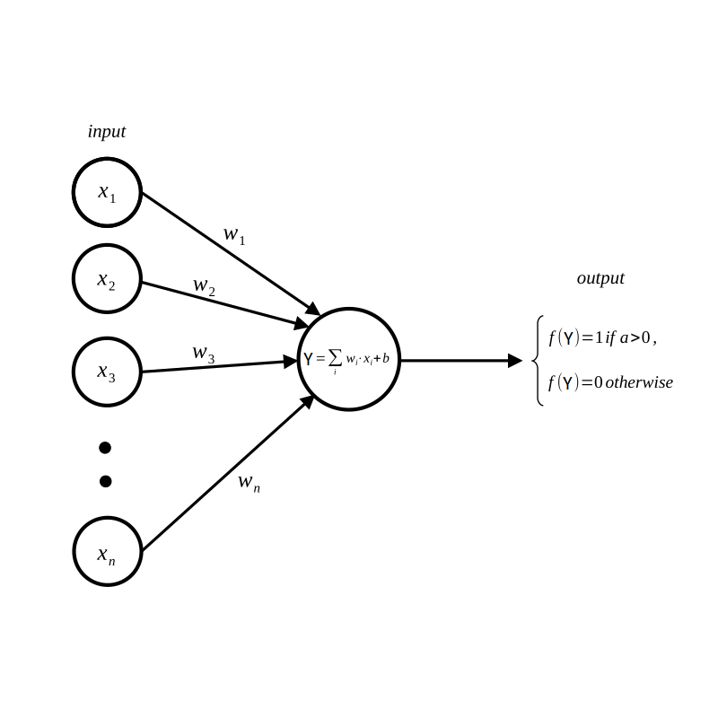
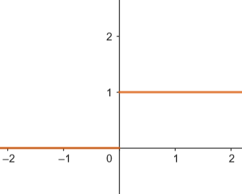
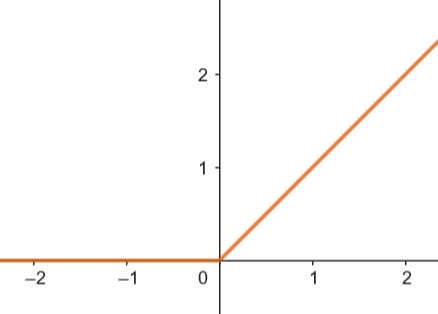
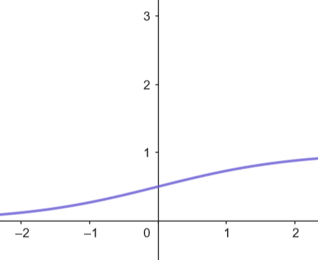

### Réseau de neurone pour la reconnaissance visuel machine (multilayer perceptron for computer vision)

## Le Perceptron

Dans leur livre de 1969: _Perceptrons: an introduction to computationnal geometry_, Marvin Minsky et Seymour Papert évoquent le **perceptron**: C'est une fonction de classifiaction f telle que: $f:{\mathbb{R}^n} \to \set{0,1}$  et graphiquement ce modèle peut être représenté par le schéma suivant:

         

Autrement dit le perceptron prend en entrée un vecteur réel et en sortie donne un
bit selon si le vecteur satisfait la **condition d'activation** du neurone: 1 si la condition d'activation est remplie 0 sinon. La condition d'activation ou **fonction d'activation** du perceptron est la suivante: $\sum_{i} w_{i} \cdot x_{i} + b > 0$.
Avec $w_{i}$ le poids associé au réel $x_{i}$ et $b$ le biais du perceptron.

L'intérêt de ce modèle est de pouvoir réaliser de la classification des données d'entrée
en fonction de ce qui active ou non le perceptron. L'idée est de nourrir le perceptron avec une donnée dont on aimerait connaître le degré de similitude à une classe de donnée dont le perceptron est entrainé à identifier. Ce modèle introduit celui du neurone qui dérive du perceptron mais dont la différence est la fonction d'activation.

### Les fonctions d'activation

Dans le cas du perceptron la fonction d'activation est très simple et son graphe est celui d'une **fonction seuil**:

Cette fonction simple d'implémentation ne permet cependant pas d'avoir de précision sur l'écart entre la sortie et la valeur seuil. Un résultat dichotomique ne nous donnera aucune information sur la fiabilté de notre analyse. 
La fonction **ReLU** ( Rectified Linear Unit ) est $f(x) = max(0, x)$ décrite par le graphe suivant:

Cette fonction est généralement utilisée dans les modèles de réseaux de neurone à multicouches possèdant donc plus d'un neurone et reliés les uns aux autres. Entre autres elle permet d'ajouter de la non linéarité au modèle ( car la réponse est différente en fonction de la valeur d'entrée ) mais elle empêche aussi l'activation systématique de tous les neurones. Dans le cas des réseaux complexes cela réduit l'activation de neurones non pertinent. Mais à terme, certains d'entre ne s'activent plus; c'est le problème du **neurone ReLU mourant** lorsque l'on a toujours $x<0$.

On peut couper court à ce problème en utilisant une fonction d'activation telle que la fonction **sigmoid** où: $\sigma(x)= {1 \over 1 + e^{-x}}$.

Cette fonction empêche les neurones de mourir car ils s'activent tous et leurs résultats sont compris entre 0 et 1 ce qui est préférable pour la classification. Néanmoins cela implique plus de calculs d'autant plus que la fonction est plus complexe.

### L'apprentissage

Le perceptron nécéssite un apprentissage. Généralement il est réalisé par **apprentissage supervisé**. Le concept est de donner au perceptron un échantillon de données et de modifier ses paramètres pour que sa sortie corresponde à la sortie attendue.
Sur le perceptron les paramètres modifiables sont les poids reliés aux entrées et le biais. Ces paramètres sont modifiés à partir de la valeur de l'entrée, de la sortie et de la sortie attendues. Bien évidemment la fonction d'activation utilisée va aussi jouer un rôle important. 
L'idée est d'utiliser la méthode de la descente du gradient à une **fonction coût** qui permet de calculer la différence entre le résultat obtenu et le résultat attendu de manière à pondérer la quantité de correction à injecter dans les paramètres. Suivant la méthode de descente de gradient, cette méthode permet de tendre chaque paramètre vers un **minimum local** pour la fonction coût, optimisant ainsi autant que faire se peut le perceptron à réaliser sa tâche.
Mettons en partique ce raisonnement:
La fonction coût que nous allons utilser est la suivante:
                    Posons $a = f(Y)$ et $L(a) = {1 \over 2 }( a - a_{attendu})^2 \newline$.
On cherche à calculer la dérivé partielle de cette fonction par rapport au poids $w_{i}$
de manière à pouvoir trouver la valeur optimale. On cherche: 
                    $\varDelta w_{i} = {\partial L(a) \over \partial w_{i}}$
Pour calculer cette dérivée partielle nous avons besoin de faire appel à la règle de la chaîne:
                ${\partial L(a) \over \partial w_{i}} = {\partial L(a) \over \partial a}{\partial a \over \partial w_{i}} \newline$
                i.e ${\partial L(a) \over \partial w_{i}} = {\partial L(a) \over \partial a}{\partial a \over \partial Y }{ \partial Y \over \partial w_{i}} \newline$
                avec, ${\partial L(a) \over \partial a} = (a - a_{attendu}) \newline$,
                ${\partial a \over \partial Y } = f'(Y) \newline$
                et ${ \partial Y \over \partial w_{i}} = x_{i}\newline$.

finalement:
                 ${\partial L(a) \over \partial w_{i}} = (a - a_{attendu}) \cdot f'(Y) \cdot x_{i} \newline$ 

En prennant la fonction ReLU: $\varDelta w_{i} = {\partial L(a) \over \partial w_{i}} = (a - a_{attendu}) \cdot x_{i} \newline$ si $Y > 0$, $0$ sinon.

En prennant la fonction ReLU: $\varDelta w_{i} = {\partial L(a) \over \partial w_{i}} = (a - a_{attendu}) \cdot (1 - \sigma(Y)) x_{i} \newline$.

Dès lors cette quantité calculé nous pouvons mettre en place la correction du poids $w_{i}$ suivant la méthode du gradient: ${w_{i}^{n+1}} = {w_{i}^{n}} + \varDelta w_{i} \cdot \alpha \newline$. Avec $\alpha$ le coefficient d'apprentissage.

### Optimisation de l'apprentissage

-Le rôle de l'initialiation des poids et La valeur du coefficient d'apprentissage